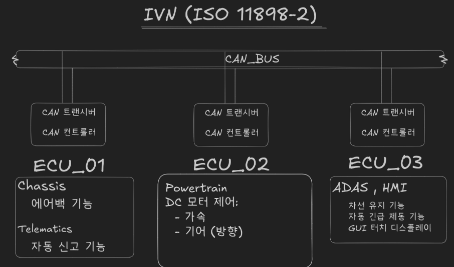
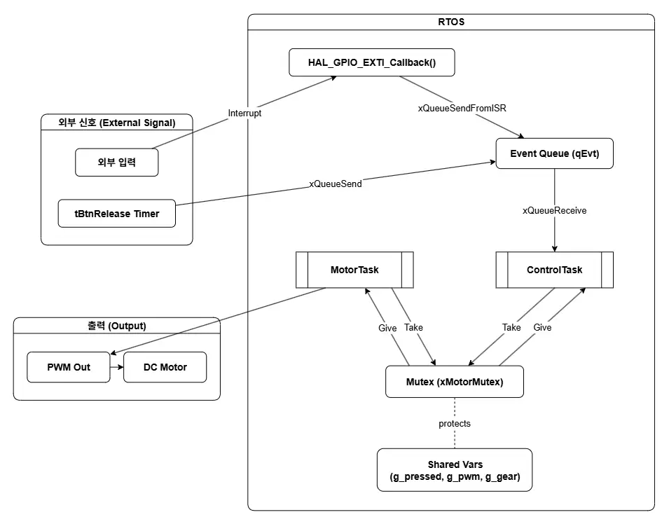
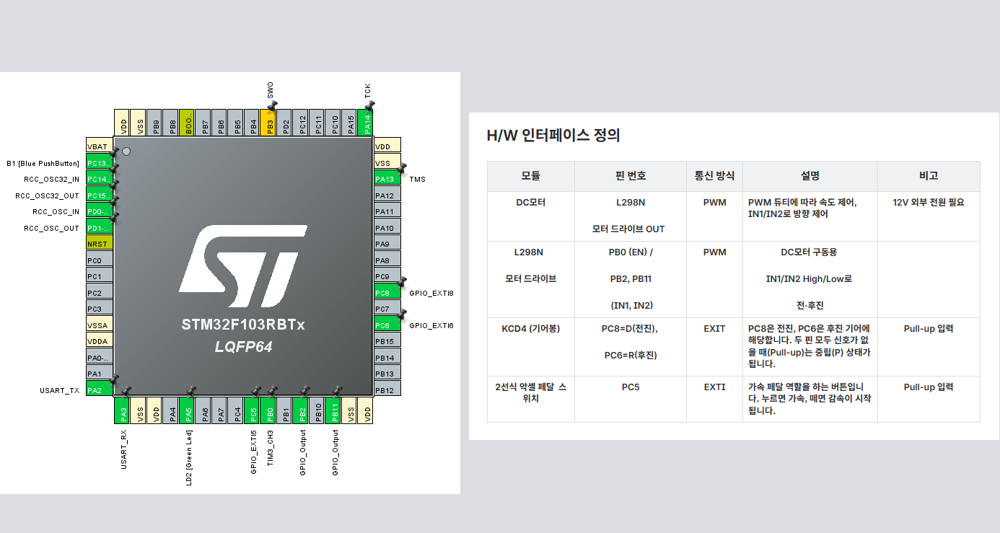

# STM32 기반 차량 ECU_02 (Powertrain) 제어 시스템

본 프로젝트는 FreeRTOS 기반으로 **가속 버튼 + 기어 입력(D/R/N)** 을 받아 DC 모터를 제어하는 **차량용 ECU 모의 시스템**입니다.  
버튼 이벤트와 기어 상태를 RTOS 태스크로 처리하며, **MotorTask 단일 제어 구조 + 뮤텍스 보호**를 통해 안정적 동작을 구현했습니다.  


## 프로젝트 개요
- **기어 제어:** D(전진), R(후진), N(중립) 상태에 따라 모터 방향 제어  
- **버튼 제어:** 버튼 누르면 가속(램프업), 버튼 떼면 감속(램프다운)  
- **안전 로직:** 주행 중 기어 변경 시 즉시 반전되지 않고 **정지 후 재출발**  
- **RTOS 구조:** 이벤트 큐와 2개의 태스크(ControlTask/MotorTask)로 역할 분리  


## 시스템 아키텍처

- ECU_02(Powertrain)은 IVN(차량 내부 네트워크) 상의 **하위 도메인 ECU**로 동작  
- ECU_01(Chassis), ECU_03(ADAS/HMI)와 도메인 분리 컨셉으로 설계됨  



## 사용 기술

- MCU: STM32 Nucleo-F103RB  
- Driver: L298N DC 모터 드라이버  
- OS: FreeRTOS  
- IDE: STM32CubeIDE  


## 펌웨어 구조 (RTOS)

- **ControlTask**  
  버튼/기어 이벤트를 큐로 받아 상태를 갱신  
- **MotorTask**  
  모터 제어 전담 (가속/감속, PWM 듀티 변화, 방향)  
- **뮤텍스(xMotorMutex)**  
  공유 변수(`g_pressed`, `g_pwm`, `g_gear`) 접근 보호  




## 하드웨어 연결

- **PC5** : 가속 버튼 (풀업, 눌림=LOW, EXTI 인터럽트)  
- **PC8 / PC6** : 기어 입력 (D/R, 풀업, Rising/Falling Edge 인터럽트)  
- **PB0** : TIM3 CH3 PWM (EN 핀 제어)  
- **PB2 / PB11** : IN1 / IN2 (모터 방향 핀)  




## 개선 포인트 (As-Is → To-Be)

### 문제 배경
- 여러 태스크(ControlTask, MotorTask)가 동시에 모터 제어 함수를 호출하는 불안정한 구조  
- 버튼 해제 시 즉시 정지 → 제어가 급격하고 기계적 안정성이 떨어짐  

### 해결 방법
- **MotorTask 단일 제어**: 실제 모터 제어 API(`Motor_Fwd/Bck/Stop`, `Motor_SetDuty`)는 MotorTask만 호출  
- **뮤텍스 적용**: 공유 변수 접근 시 `xMotorMutex`로 보호 → 충돌 방지 및 데이터 일관성 확보  
- **부드러운 제어**: 버튼 해제 시 단계적 감속 후 정지  


## 코드 비교

### ControlTask – EVT_BTN_DOWN

```c
// As-Is
if (!g_pressed) {
  g_pressed = 1;
  if (g_gear != GEAR_NEUTRAL) {
    if (g_gear == GEAR_FWD) Motor_Fwd(); else Motor_Bck();
    Motor_SetDuty(START_DUTY);   // ← 듀티 직접 변경 (충돌 위험)
  }
}

// To-Be
xSemaphoreTake(xMotorMutex, portMAX_DELAY);
if (!g_pressed) {
  g_pressed = 1;
  if (g_gear != GEAR_NEUTRAL) {
    if (g_gear == GEAR_FWD) Motor_Fwd(); else Motor_Bck();
    // 듀티 변경은 MotorTask가 전담 ← 제거
  }
}
xSemaphoreGive(xMotorMutex);
```

### MotorTask – 가/감속 루프

```c
// As-Is
if (!g_pressed || g_gear == GEAR_NEUTRAL) {
  if (g_pwm != 0) Motor_Stop();          // ← 버튼 해제 시 즉시 정지
} else {
  if (g_gear == GEAR_FWD) Motor_Fwd(); else Motor_Bck();
  // 주기적으로 g_pwm 증가
}

// To-Be
xSemaphoreTake(xMotorMutex, portMAX_DELAY);
if (!g_pressed || g_gear == GEAR_NEUTRAL) {
  // 버튼 해제/중립 → 단계적 감속
  if (g_pwm > 0) {
    if (g_pwm > PWM_STEP) g_pwm -= PWM_STEP;
    else g_pwm = 0;
    Motor_SetDuty(g_pwm);
  } else {
    Motor_Stop();                          // 완전 정지
  }
} else {
  if (g_gear == GEAR_FWD) Motor_Fwd(); else Motor_Bck();
  if (g_pwm < START_DUTY)      Motor_SetDuty(START_DUTY);
  else if (g_pwm < PWM_MAX)    Motor_SetDuty(g_pwm + PWM_STEP);
}
xSemaphoreGive(xMotorMutex);

```
## 참고 문서

- [ECU_02 상세 설계 문서](docs/ECU_02_상세_설계.pdf)  
- [프로젝트 컨셉 및 전체 개요](docs/프로젝트_컨셉_및_전체_개요.pdf)
